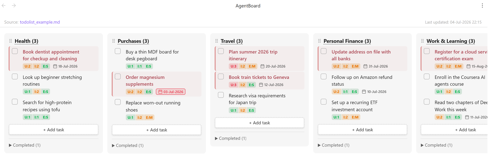

# AgentBoard

An Obsidian plugin that renders a Markdown todo file as a Google Tasks–style board — synced in real time, in both directions.



AgentBoard is designed to pair with an **agentic skill**: an AI agent (for example, a Claude Code slash command) captures your brain-dump of tasks and writes them into a single Markdown file in the format described below, scoring each task for urgency, importance, and effort. AgentBoard then visualizes that file as a prioritized board — and any edit you make on the board is written straight back to the Markdown, so the agent and the board stay in lock-step.

> **Companion skill:** [`skills/agentboard-sync/SKILL.md`](skills/agentboard-sync/SKILL.md) is a ready-to-use Claude Code skill that produces this format — it scans your vault notes for todos, scores them, and keeps the board file ranked. Copy it into `.claude/skills/agentboard-sync/` in your vault (or `~/.claude/skills/`) and edit its Configuration section for your folders. Any other agent (or you, by hand) can maintain the file too, as long as it follows the format below.

## How it works

1. **An agent maintains the file.** A skill ingests your tasks and writes/updates the todo Markdown file, assigning each task the attribute block described in [Todo file format](#todo-file-format).
2. **AgentBoard renders it.** Each heading becomes a column; each task becomes a card showing its urgency/importance/effort and due date. Changes to the file appear on the board instantly.
3. **You refine on the board.** Editing a task's score, due date, or critical flag writes back to the file and stamps it `UsrEdit:Y` — a signal to the agent to leave that task's values alone on its next run.

## Todo file format

This is the contract between the agent skill and AgentBoard. Any file that follows it can be visualized.

```markdown
This note is a brain dump of things to do, in no particular order.

Last updated on: 04-Jul-2026 22:15

## Health
About: Physical and mental wellbeing.

- [ ] Book dentist appointment for checkup and cleaning [U:2 I:2 T:4 E:S Due:18-Jul-2026 Crit:Y]
- [ ] Look up beginner stretching routines [U:1 I:2 T:3 E:S Due:- Crit:N]
- [x] Start a daily 10-minute walk habit [U:2 I:3 T:5 E:S Due:- Crit:Y]

## Finance
About: Money, banking, and investments.

- [ ] Update address on file with all banks [U:2 I:3 T:5 E:M Due:31-Jul-2026 Crit:Y]
- [ ] Set up a recurring ETF investment account [U:1 I:2 T:3 E:M Due:- Crit:N]

## Travel
About: Upcoming trips and travel planning.

- [ ] Plan summer trip itinerary [U:3 I:2 T:5 E:M Due:20-Jul-2026 Crit:Y]
    - [ ] Shortlist destinations and compare costs [U:3 I:2 T:5 E:S Due:14-Jul-2026 Crit:Y]
    - [x] Agree on travel dates with everyone [U:3 I:2 T:5 E:S Due:- Crit:Y]
```

### Structure

- **Columns** — every `#`, `##`, or `###` heading becomes a column.
- **Tasks** — `- [ ]` is an open task, `- [x]` is completed. Completed tasks collapse into a foldable section per column.
- **Subtasks** — an indented task line (4 spaces preferred; any leading spaces or tabs work) belongs to the nearest non-indented task above it. One level of nesting. Subtasks carry the same attribute block as regular tasks.
- **`About:`** — an optional line directly under a heading; shown as a hover tooltip on the column title.
- **`Last updated on:`** — an optional line anywhere in the file; shown in the board's top bar. Display only — AgentBoard never rewrites it, so the agent should maintain it.
- **`[[wiki-links]]`** — render as clickable links inside task text.

### Task attribute block

Each task line ends with a bracketed block of `Key:Value` tokens, emitted in this order (`U I T E Due Crit`):

```
[U:2 I:3 T:5 E:M Due:31-Jul-2026 Crit:Y]
```

| Key | Meaning | Values | Notes |
|-----|---------|--------|-------|
| `U` | **Urgency** | `1`–`3` | 3 = most time-sensitive |
| `I` | **Importance** | `1`–`3` | 3 = most impactful |
| `T` | **Total** | `2`–`6` | **Derived:** `T = U + I`. Used for ranking. |
| `E` | **Effort** | `S` / `M` / `L` | Estimated time to complete |
| `Due` | **Deadline** | `DD-Mon-YYYY` or `-` | e.g. `30-Jun-2026`; `-` for none. Year-less `DD-Mon` is accepted (year is inferred) but `DD-Mon-YYYY` is preferred. |
| `Crit` | **Critical flag** | `Y` / `N` | **Derived:** `Y` when `U ≥ 2 AND I ≥ 2`, otherwise `N`. |
| `UsrEdit` | **User-edited flag** | `Y` | Written by AgentBoard when a user edits a task on the board. **Not emitted by the agent.** |

### Rules for the agent skill

- **Recompute derived fields.** `T` and `Crit` are functions of `U`/`I` — always keep them consistent (`T = U + I`; `Crit = Y` iff `U ≥ 2 AND I ≥ 2`).
- **Do not emit `UsrEdit`.** It is owned by AgentBoard. Its presence (`UsrEdit:Y`) means the user has manually adjusted that task.
- **Respect `UsrEdit:Y`.** When regenerating or re-scoring the file, do **not** overwrite the U/I/E/Due/Crit values of any task marked `UsrEdit:Y` — the user's choices win.
- **Preserve the block order and formatting** so diffs stay clean.
- **Keep a parent and its subtasks together.** They form one block — subtasks stay indented directly under their parent through any re-ordering.

### On the board

- The card shows a single `U | I | E` pill with each section colored by value — red (`U`/`I` = 3, `E` = L), amber (= 2, `E` = M), green (= 1, `E` = S).
- The due date appears with a calendar icon; if it has passed, the date is outlined in red.
- Critical tasks are marked with a muted red stripe and slightly emphasized text.
- Subtasks render indented under their parent, which shows a `1/3`-style progress pill and a chevron to collapse/expand them. Completing every subtask completes the parent; completing the parent completes all subtasks.

## Features

- **Board view** — headings become columns, tasks become cards
- **Real-time two-way sync** — file edits (including by an agent) and board edits stay in sync instantly
- **On-board editing** — click a `U`/`I`/`E` section to change it, click the due date to pick a new one; changes (and derived `T`/`Crit`) write back to the file and stamp `UsrEdit:Y`
- **Due dates** — shown with a calendar icon; overdue dates are highlighted
- **Critical tasks** — derived from `Crit`, or toggled manually via the `⋯` menu
- **Add / edit / delete / complete** tasks directly on the board
- **Subtasks** — nested one level under a parent, with two-way auto-completion (all subtasks done ⇢ parent done; parent done ⇢ all subtasks done), a progress pill, collapse/expand, and "Add subtask" in the `⋯` menu
- **Rename & reorder columns** — double-click a title to rename (writes back); drag the `⠿` handle to reorder (board-only, doesn't touch the file)
- **Wiki-links** — `[[note]]` links render clickable with `[[` autocomplete
- **Hover descriptions** — `About:` lines become column tooltips
- **Source & timestamp** — the active file and its `Last updated on:` line are shown at the top of the board

## Installation

### From the Obsidian community plugins directory

1. Open **Settings → Community plugins → Browse**
2. Search for **AgentBoard**
3. Click **Install**, then **Enable**

### Manual installation

1. Download `main.js`, `manifest.json`, and `styles.css` from the [latest release](https://github.com/aniruddh-jammoria/obsidian-agentic-todolist/releases/latest)
2. Copy them into `<your vault>/.obsidian/plugins/agent-board/`
3. Enable the plugin in **Settings → Community plugins**

## Configuration

Open **Settings → AgentBoard** and set the path to your todo Markdown file, relative to the vault root (e.g. `todo.md` or `notes/todos.md`). The field autocompletes from all `.md` files in your vault.

## Usage

- Open the board via the **checkbox icon** in the left ribbon, or run **Open AgentBoard** from the command palette
- **Add a task** — click `+ Add task` at the bottom of a column, type, press Enter
- **Complete a task** — click the checkbox; it moves to the Completed section
- **Edit text** — double-click the task text
- **Change U / I / E** — click that section of the score pill and pick a value
- **Set / change a due date** — click the due date (or the faint calendar icon on a task without one)
- **Add a subtask** — hover a task, click `⋯`, choose **Add subtask**
- **Collapse subtasks** — click the small chevron at the bottom-right of a parent task
- **Critical / Delete** — hover a task, click `⋯`, choose from the menu
- **Rename a column** — double-click the title
- **Reorder columns** — drag the `⠿` handle
- **Open the source file** — click the filename at the top of the board

## Development

```bash
git clone https://github.com/aniruddh-jammoria/obsidian-agentic-todolist
cd obsidian-agentic-todolist
npm install
npm run dev   # watch mode
npm run build # production build
```

Copy `main.js`, `manifest.json`, and `styles.css` into `<vault>/.obsidian/plugins/agent-board/` to test. See [AGENTS.md](AGENTS.md) for architecture and contributor notes.

## License

[MIT](LICENSE)
